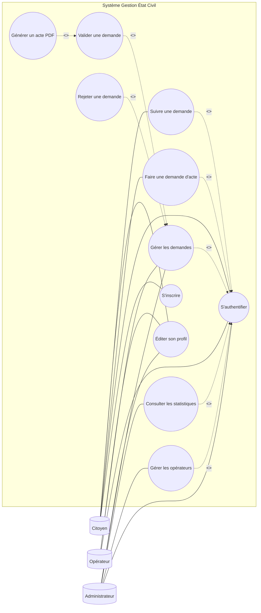
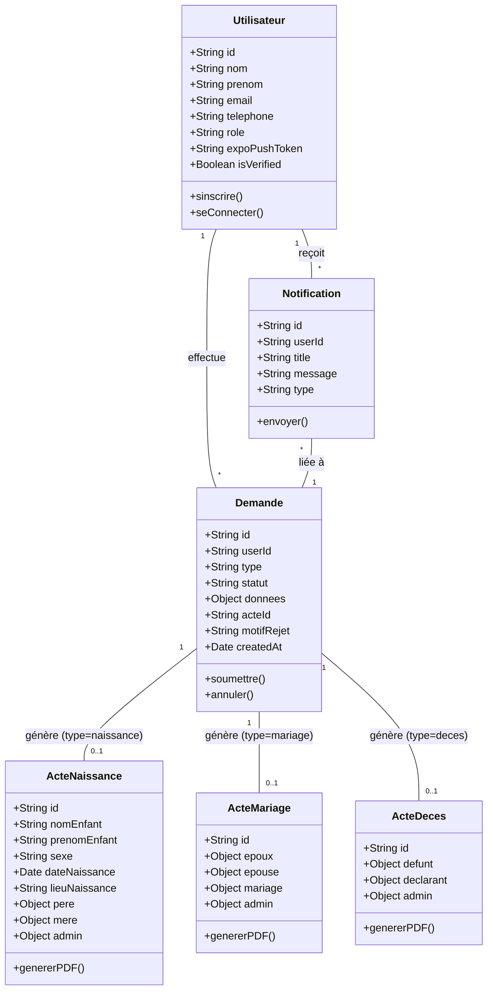

# Rapport de Fin d'Études : Plateforme de Gestion de l'État Civil (Tchad)

---

## Liste des Abréviations

| Abréviation | Signification |
| :--- | :--- |
| PFE | Projet de Fin d'Études |
| UML | Unified Modeling Language |
| API | Application Programming Interface |
| REST | Representational State Transfer |
| JWT | JSON Web Token |
| OTP | One-Time Password |
| QR Code | Quick Response Code |
| PDF | Portable Document Format |
| NoSQL | Not Only SQL |
| SQL | Structured Query Language |
| SDK | Software Development Kit |
| HTTP(S) | HyperText Transfer Protocol (Secure) |
| UI/UX | User Interface / User Experience |
| SIGEC | Système Intégré de Gestion de l'État Civil |
| BaaS | Backend as a Service |
| HTML | HyperText Markup Language |
| CSS | Cascading Style Sheets |
| JS | JavaScript |
| JSON | JavaScript Object Notation |
| SGBD | Système de Gestion de Base de Données |
| CRUD | Create, Read, Update, Delete |
| SMS | Short Message Service |

---

## Chapitre 3 : Conception et Modélisation (UML)

Ce chapitre contient tous les diagrammes UML essentiels pour la conception de la plateforme.

### 1. Diagrammes de Cas d'Utilisation

#### 1.1. Diagramme de Cas d'Utilisation Global

#### 1.2. Diagramme de Classes

---

## Chapitre 4 : Réalisation de la Solution

### 1. Introduction
Ce chapitre est consacré à la phase de réalisation de notre application de gestion de l'état civil. Après avoir défini les besoins et conçu l'architecture dans les chapitres précédents, nous présentons ici les outils, les technologies et les interfaces finales qui constituent la solution.

### 2. Environnement de Travail
#### 2.1. Environnement Logiciel
- **Visual Studio Code (VS Code) :** Éditeur de code source principal.
- **Git & GitHub :** Pour le contrôle de version.
- **Node.js :** Environnement d'exécution backend.
- **Expo Go :** Pour la prévisualisation mobile.

### 3. Stack Technique
- **Frontend :** React.js (v19), Bootstrap 5, Recharts.
- **Mobile :** React Native & Expo (SDK 54).
- **Backend :** Node.js & Express (v5), JWT.
- **Base de données :** Cloud Firestore (NoSQL).
- **Stockage :** Cloud Storage.
- **Auth :** Firebase Authentication (OTP, Email/Pass).

### 4. Présentation des Interfaces
#### 4.1. Authentification
- **Interface de Connexion :** Hachage bcrypt, design réactif.
- **Interface d'Inscription :** Collecte des données et validation sécurisée par OTP.

#### 4.2. Espace Citoyen
- Tableau de bord, formulaires de demande (Naissance, Mariage, Décès) et timeline de suivi en temps réel.

#### 4.3. Portail Administration
- Gestion des demandes, validation/rejet et génération automatique d'actes PDF avec QR Code.

---

## Conclusion Générale

Au terme de ce mémoire de fin d’études, nous avons abordé avec rigueur le thème « Conception et implémentation d’une plateforme en ligne pour la gestion de l’état civil au Tchad ».

Notre plateforme offre aux citoyens la possibilité d’effectuer leurs demandes d’actes d’état civil (naissance, mariage, décès) en ligne, sans avoir à se déplacer physiquement dans les centres administratifs.

La mise sur pied de cette plateforme nous a permis d’acquérir des connaissances approfondies sur les outils informatiques modernes (React, Node.js, Firebase).

À long terme, nous espérons pouvoir ajouter :
- Le paiement sécurisé des frais en ligne.
- L’envoi automatique d’une copie numérique certifiée par e-mail.
- L'intégration d'une signature numérique officielle.
- Un système de vérification par QR Code.

---

## Références Bibliographiques et Webographiques

*   Pascal Roques, *UML 2 par la pratique : Études de cas et exercices corrigés*, Éditions Eyrolles.
*   Robert C. Martin, *Clean Code: A Handbook of Agile Software Craftsmanship*, Prentice Hall.
*   Rapport de PFE, *Numérisation des services d'état civil : Étude et mise en œuvre*, Université de N’Djaména, 2022.
*   Rapport de PFE, *Conception et développement d'une application de gestion administrative via le cloud*, Institut National Supérieur des Sciences et Techniques d'Abéché, 2023.
*   Loi n°008/PR/2013, *Portant organisation de l'état civil au Tchad* (Référence juridique).
*   Documentation React.js : https://react.dev/
*   Documentation Node.js : https://nodejs.org/
*   Documentation Firebase : https://firebase.google.com/docs
*   Documentation React Native / Expo : https://docs.expo.dev/
*   Bootstrap 5 (Framework CSS) : https://getbootstrap.com/
*   JWT (JSON Web Token) : https://jwt.io/
*   Stack Overflow : https://stackoverflow.com/ (Résolution de problèmes techniques).
*   GitHub : https://github.com/ (Gestion du code source et collaboration).
*   MDN Web Docs : https://developer.mozilla.org/
