# Modèles UML pour le Rapport PFE

Ce document contient tous les diagrammes UML essentiels pour votre chapitre "Conception". Tous les diagrammes utilisent la syntaxe Mermaid valide et peuvent être visualisés dans VS Code ou sur Mermaid Live Editor.

---

## 1. Diagrammes de Cas d'Utilisation

### 1.1. Diagramme de Cas d'Utilisation Global (Style StarUML)

Ce diagramme utilise une frontière de système (System Boundary) pour séparer les acteurs externes des fonctionnalités internes.

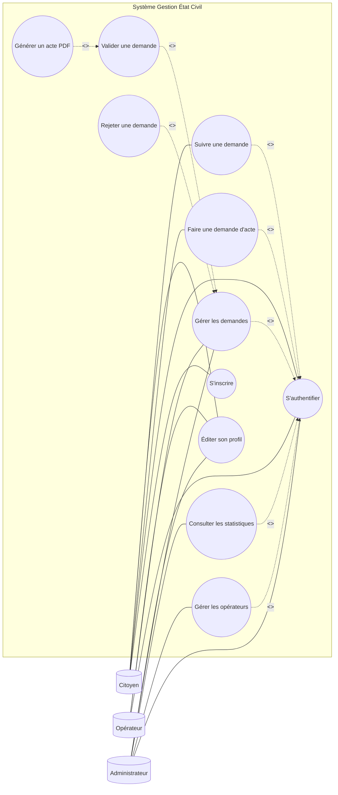

**Note StarUML :** Les relations `<<include>>` indiquent que l'authentification est obligatoire pour accéder aux services. Les extensions `<<extend>>` montrent des actions spécifiques lors de la gestion des demandes.

---

### 1.2. Diagramme Détaillé - Espace Citoyen

```mermaid
graph LR
    Citoyen[("Citoyen")]
    
    subgraph "Frontière Système : Portail Citoyen"
        UC_C1((S'inscrire))
        UC_C2((Vérifier OTP))
        UC_C3((S'authentifier))
        
       1((Acte Naissance))
            UC_C42((Acte Mariage))
            UC_C43((Acte Décès))
        end
        
        UC_C41 --|> UC_C4
        UC_C42 --|> UC_C4
        UC_C43 --|> UC_C4
        
        UC_C1 -.->|"<<include>>"| UC_C2
        UC_C4 -.->|"<<include>>"| UC_C3
        UC_C5 -.->|"<<include>>"| UC_C3
        
        UC_C7 -.->|"<<extend>>"| UC_C5
    end
    
    Citoyen --- UC_C1
    Citoyen --- UC_C3
    Citoyen --- UC_C4
    Citoyen --- UC_C5
``` subgraph "Gestion des Demandes"
            UC_C4((Nouvelle demande))
            UC_C5((Suivre état demande))
            UC_C6((Payer frais mairie))
            UC_C7((Récupérer acte PDF))
        end
        
        subgraph "Spécialisation des Demandes"
            UC_C4

---

### 1.3. Diagramme Détaillé - Espace Administration (Style StarUML)

```mermaid
graph LR
    Admin[("Administrateur")]
    Operateur[("Opérateur")]
    
    subgraph "Frontière Système : Portail Administration"
        UC_A1((S'authentifier))
        
        subgraph "Gestion des Demandes"
            UC_A2((Consulter demandes))
            UC_A4((Valider demande))
            UC_A5((Rejeter demande))
            UC_A6((Générer PDF + QR))
        end
        
        subgraph "Gestion des Ressources"
            UC_A7((Gérer opérateurs))
            UC_A8((Gérer actualités))
            UC_A9((Consulter statistiques))
            UC_A10((Voir logs système))
        end
        
        UC_A2 -.->|"<<include>>"| UC_A1
        UC_A7 -.->|"<<include>>"| UC_A1
        UC_A8 -.->|"<<include>>"| UC_A1
        UC_A9 -.->|"<<include>>"| UC_A1
        
        UC_A4 -.->|"<<extend>>"| UC_A2
        UC_A5 -.->|"<<extend>>"| UC_A2
        UC_A6 -.->|"<<include>>"| UC_A4
    end
    
    Operateur --- UC_A1
    Operateur --- UC_A2
    
    Admin --- UC_A1
    Admin --- UC_A7
    Admin --- UC_A8
    Admin --- UC_A9
    Admin --- UC_A10
```

---

### 2.1. Diagramme de Classes (Structure Réelle de l'Application)
**Fiche descriptive :**
- **Acteur :** Citoyen, Agent/Officier, Administrateur (basé sur le champ `role` de l'Utilisateur).
- **Entités principales :** 
    - `Utilisateur` : Géré via Firebase Auth et stocké dans la collection `users`.
    - `Demande` : Créée par le Citoyen, stockée dans `demandes`. Elle contient les `donnees` (objet flexible).
    - `Acte` (Naissance, Mariage, Décès) : Créé uniquement après validation de la demande.
- **Logique de validation :** Une `Demande` contient un `type` (naissance/mariage/deces) et une fois validée, elle génère un document dans la collection correspondante et lie son `id` via `acteId`.

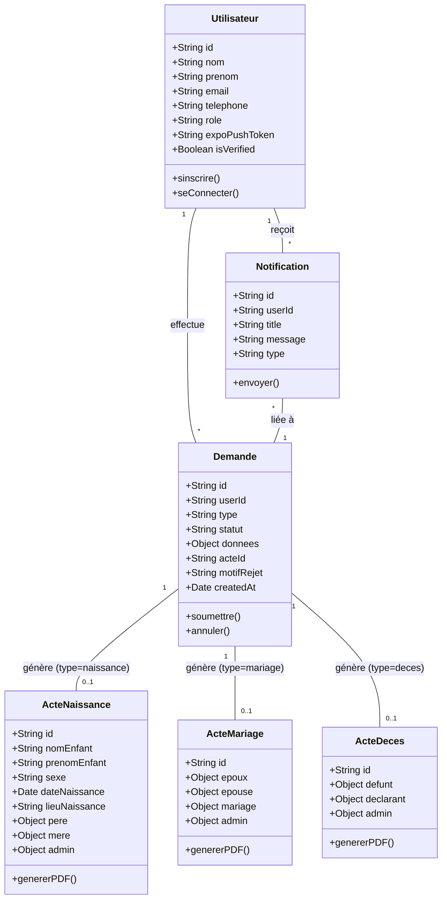

**Résumé :** Ce diagramme reflète l'implémentation technique réelle. L'Utilisateur (Citoyen) soumet une `Demande` générique dont le type définit quel modèle d'acte (`ActeNaissance`, `ActeMariage`, `ActeDeces`) sera instancié dans Firestore après validation par un Administrateur.

---

## 3. Diagrammes d'Activités (StarUML Style)

### 3.1. Faire une demande d'acte
Ce diagramme d'activité illustre le parcours du citoyen pour la soumission d'une demande d'acte d'état civil. Il commence par l'authentification de l'utilisateur, suivie du choix du type d'acte. Le processus détaille le remplissage du formulaire et se termine par la soumission de la demande, plaçant le dossier dans un état « En Attente » pour traitement par les services municipaux.

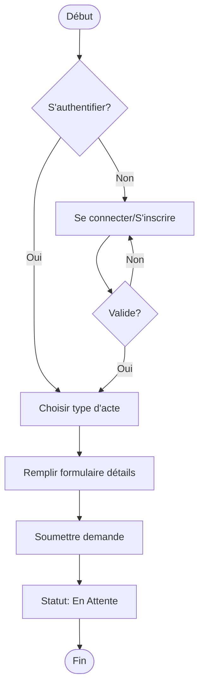

---

### 3.2. Suivre une demande
Ce diagramme détaille le cycle de vie d'une demande après sa soumission. Il présente les différents états possibles (Validée, Rejetée ou En Attente) et les actions associées, comme la rectification des erreurs en cas de rejet ou le paiement des frais en ligne. Le processus aboutit à la délivrance de l'acte officiel en format PDF après validation finale.

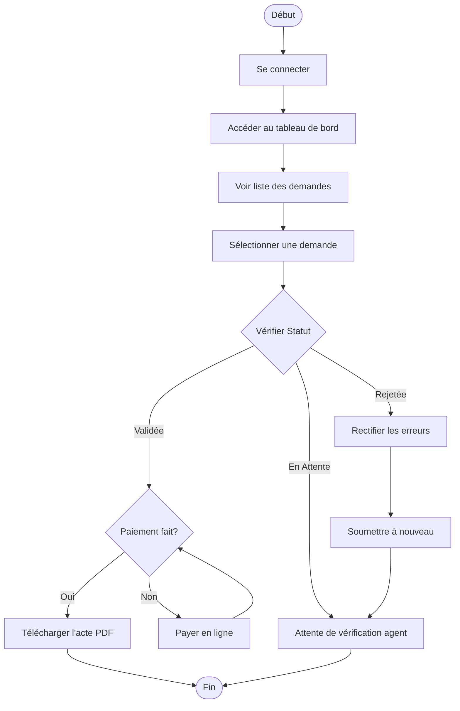

---

### 3.3. Authentification Administrateur
Ce diagramme d'activité décrit le processus d'authentification d’un utilisateur administratif, depuis la saisie des identifiants jusqu’à la validation de l'accès selon le rôle (Admin ou Opérateur). Il détaille les étapes de vérification des informations, le contrôle des erreurs et l’accès accordé ou refusé, assurant ainsi la sécurité et la fiabilité de la connexion au système de gestion.

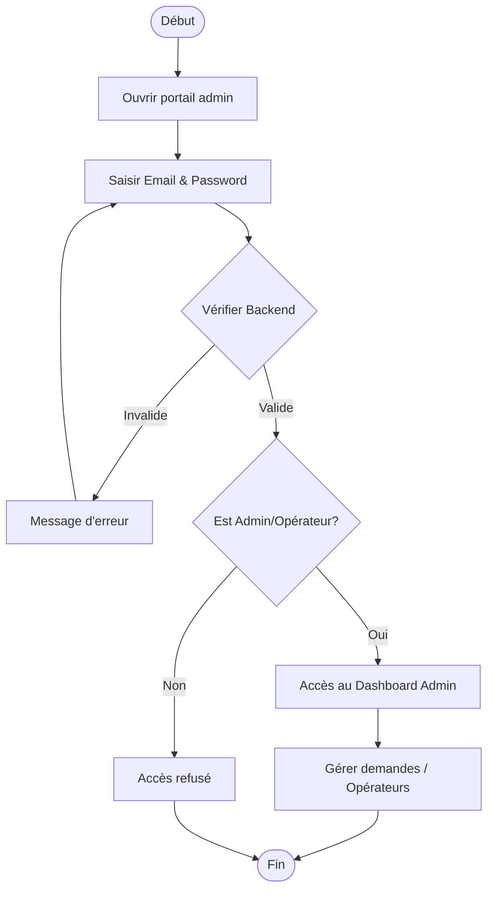

---

## 4. Diagrammes de Séquence (StarUML Style)

Le diagramme de séquence est un diagramme d'interaction qui montre comment les processus opèrent les uns avec les autres et dans quel ordre. Il se concentre sur l'échange de messages entre les différents objets ou acteurs du système au fil du temps.

### 4.1. Faire une demande d'acte (Style StarUML)
**Fiche descriptive :**
- **Acteur :** Citoyen
- **Action réalisée :** Soumission d'une demande d'acte (Naissance/Mariage/Décès).
- **Condition :** L'utilisateur doit remplir toutes les étapes obligatoires du formulaire.
    - Le système valide les données à chaque étape du formulaire.
    - Si les données sont valides, la demande est enregistrée avec le statut "En attente".
    - Sinon, des alertes de validation s'affichent pour correction.

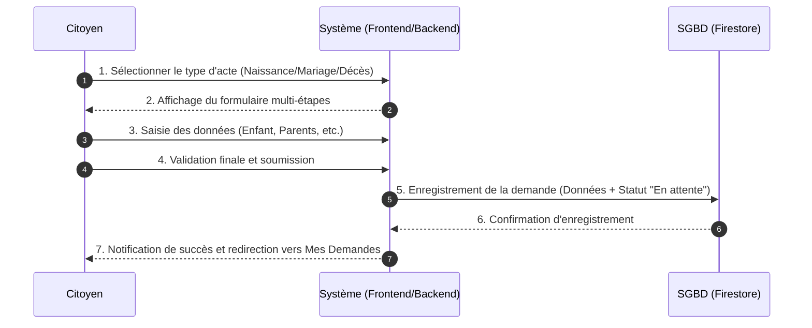

**Résumé :** Ce diagramme décrit le parcours d'un citoyen soumettant une nouvelle demande d'acte civil. Le système guide l'utilisateur à travers un formulaire structuré avant de stocker les données de manière sécurisée dans Firestore pour traitement ultérieur.

---

### 4.2. Suivre l'état d'une demande (Style StarUML)
**Fiche descriptive :**
- **Acteur :** Citoyen
- **Action réalisée :** Suivre une demande.
- **Condition :** L’utilisateur accède à sa liste de demandes.
    - Le système récupère et vérifie l’existence de demandes pour cet utilisateur.
    - Si des demandes existent, le système affiche leurs statuts et permet de voir la timeline.
    - Sinon, le système informe qu'aucune demande n'a été trouvée.

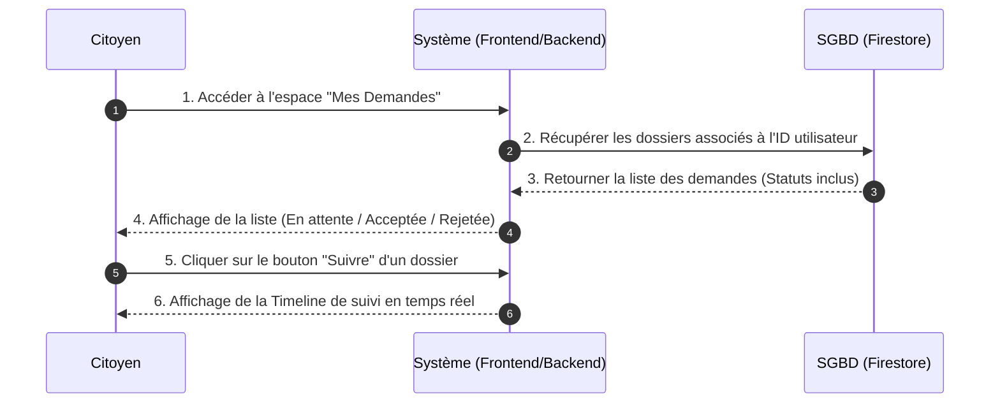

**Résumé :** Ce flux illustre la consultation de l'avancement des dossiers. Le système interroge dynamiquement la base de données pour fournir au citoyen un état visuel (Timeline) du traitement de ses demandes en cours ou passées.

---

### 4.3. Inscription Citoyen avec OTP (Style StarUML)
**Fiche descriptive :**
- **Acteur :** Citoyen
- **Action réalisée :** Inscription sécurisée avec vérification OTP.
- **Condition :** L’utilisateur doit fournir un numéro de téléphone ou email valide.
    - Le système envoie un code de vérification unique au citoyen.
    - Si le code saisi est correct, le compte utilisateur est officiellement créé dans Firestore.
    - Sinon, le système affiche un message d'erreur et demande un nouveau code.

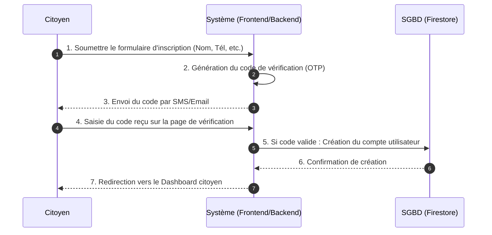

**Résumé :** Ce diagramme détaille la procédure de création de compte sécurisée. Elle repose sur une double validation (formulaire + code OTP) pour garantir l'authenticité des coordonnées du citoyen avant d'activer son accès au service.

---

### 4.4. Validation et Remplissage d'acte (Admin)
**Fiche descriptive :**
- **Acteur :** Admin/Officier
- **Action réalisée :** Validation d'une demande et génération d'acte.
- **Condition :** Un dossier complet doit être présent dans la liste des tâches.
    - L'officier vérifie les informations et valide le dossier.
    - Si validé, le système génère automatiquement le PDF officiel avec signature numérique.
    - En cas de non-conformité, l'officier peut demander des corrections ou rejeter.

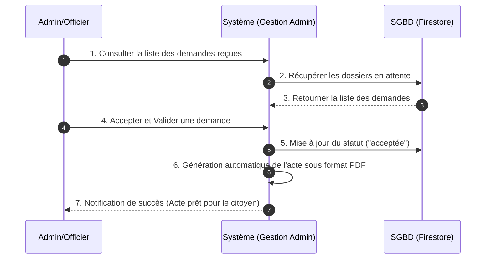

**Résumé :** Ce processus décrit la phase finale de traitement par l'administration. L'officier valide le dossier, déclenchant l'archivage numérique et la création instantanée de l'acte officiel sécurisé (PDF avec signature et QR Code).

---

## 5. Diagramme Entité-Relation (ERD - Firestore)

Ce diagramme représente la structure des données NoSQL au sein de Firebase Firestore.

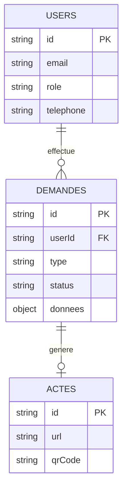

---

## 5. Diagramme d'États-Transitions (StarUML Style)

Ce diagramme modélise le cycle de vie d'une demande d'acte d'état civil, de sa création à sa délivrance finale.

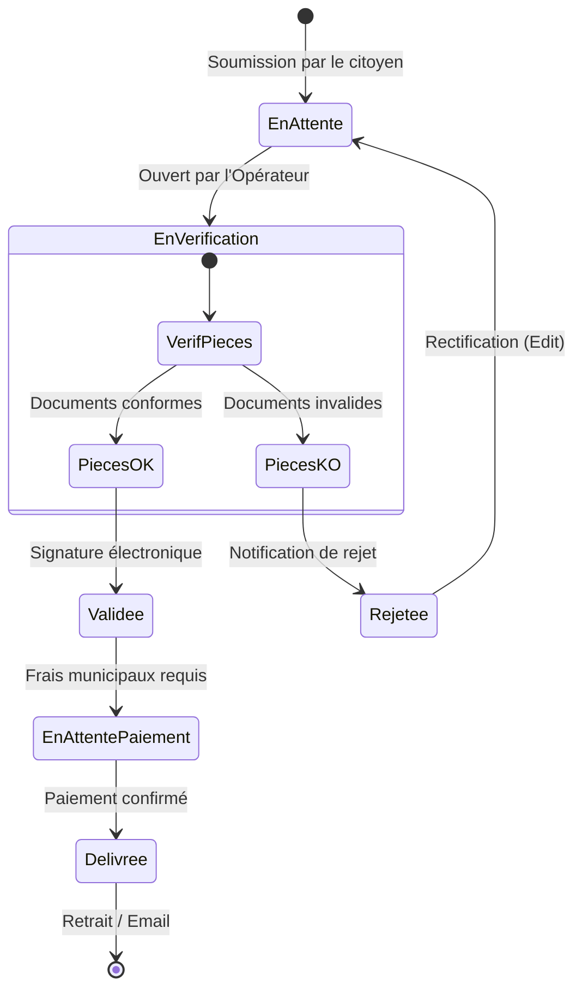

---

## 6. Diagramme de Déploiement (StarUML Style)

Ce diagramme illustre l'architecture matérielle et logicielle physique du système.

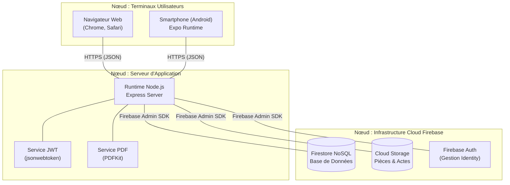

---

## Résumé des Diagrammes

| Diagramme | Description | Utilité |
|-----------|-------------|---------|
| **Cas d'utilisation global** | Vue d'ensemble avec authentification centrale | Montre tous les acteurs et leurs interactions principales |
| **Cas d'utilisation Citoyen** | Détails des fonctionnalités citoyen | Explique le parcours utilisateur complet |
| **Cas d'utilisation Admin** | Détails des fonctionnalités admin | Montre la gestion et l'administration |
| **Diagramme de classes** | Structure des données | Modélise les entités et leurs relations |
| **Diagramme d'activités** | Workflow de traitement | Montre le processus métier complet |
| **Diagramme de séquence - Demande** | Échanges techniques | Détaille les appels API avec JWT |
| **Diagramme de séquence - Inscription** | Processus d'inscription | Montre le flux OTP complet |
| **Diagramme d'États** | Cycle de vie de la demande | Détaille les changements de statut |
| **Diagramme de Déploiement** | Architecture physique | Montre les serveurs et clients |

---

## Notes Importantes

✅ **Tous les diagrammes incluent l'authentification** comme élément central  
✅ **Syntaxe Mermaid valide** - Peut être visualisée dans VS Code ou Mermaid Live  
✅ **Basé sur votre code réel** - Reflète l'implémentation actuelle  
✅ **Prêt pour le rapport** - Format professionnel pour la soutenance  

Ces diagrammes peuvent être copiés directement dans votre rapport PFE ! 🎓
